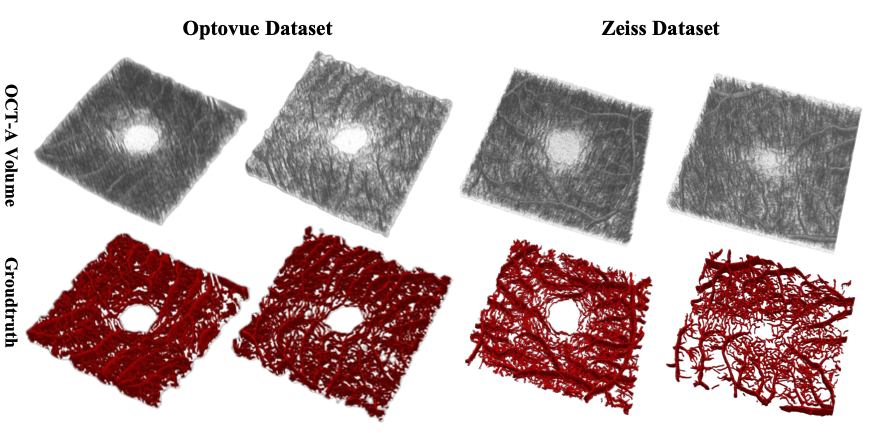

# Artifact-suppressed 3D Retinal Microvascular Segmentation via Multi-scale Topology Regulation
This work is currently under review. 

Two OCTA datasets were employed in this study. The first is a clinical dataset that includes scans from both healthy individuals and patients with diabetic retinopathy, acquired at a typical macular field of view (3 × 3 mm). The second dataset consists of annotated scans from healthy subjects with the same imaging resolution. These datasets were used to validate the proposed method in terms of segmentation accuracy, robustness, and generalizability across different imaging conditions.

🚀**Download**
This is a public dataset for 3D OCTA; the link is [here](https://zenodo.org/records/17149202). 

