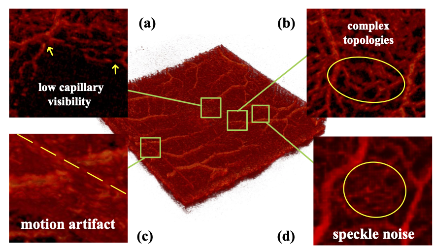

# Artifact-suppressed 3D Retinal Microvascular Segmentation via Multi-scale Topology Regulation

## Dataset Overview

This work is currently under review. 

Two OCTA datasets were employed in this study. The first is a clinical dataset that includes scans from both healthy individuals and patients with diabetic retinopathy, acquired at a typical macular field of view (3 × 3 mm). The second dataset consists of annotated scans from healthy subjects with the same imaging resolution. These datasets were used to validate the proposed method in terms of segmentation accuracy, robustness, and generalizability across different imaging conditions.

---

### Example OCTA Images

OCTA volumes typically exhibit motion artifacts and noise, which make vessel segmentation challenging.

*Example 3D OCTA image with visible vascular structures and imaging artifacts.*

---

### Annotation Samples

Manual vessel annotations are provided for selected scans.

*Left: Original OCTA en face image. Right: Corresponding vessel annotation.*

---

### Potential Applications

* Retinal vessel segmentation
* Cross-dataset generalization studies

*Illustration of typical research tasks supported by this dataset.*

### Download

This is a public dataset for 3D OCTA; the link is [here](https://zenodo.org/records/17149202). 

---
